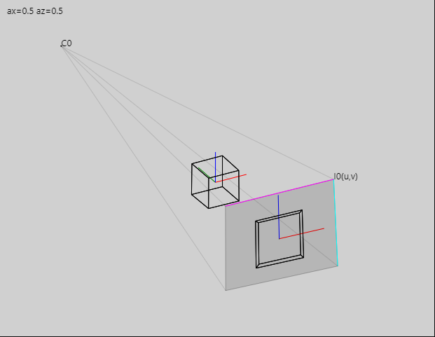

# ProjectiveGeometry23
## Projective Geometry of Two- and Three-space

`ProjectiveGeometry23` is a collection of numpy-based utilities for projective geometry of real two- and three-space, including homogeneous coordinates of point, lines and planes, Plücker coordinates and projection matrices.

The package has been converted from an existing C++ implementation [LibProjectiveGeometry](https://github.com/aaichert/LibProjectiveGeometry), which is well-tested and obviously faster.

The main use of this code is for the visualization or X-Ray source-detector geometries but applied generally to geometric computer vision problems. 

Features:
 - Computing with points, lines and planes
 - Plücker coordinates, Plücker matrices
 - Projection matrices, intrinsic and extrinsic parameters
 - Decomposition of projection matrices, backprojection
 - Visualization of X-Ray source-detector geometries
 - (WIP) estimation based on direct linear transform, X-ray calibraion

General recommendation for better readibility of outputs:

```py
from rich import print
np.set_printoptions(suppress=True)
```

Example of an interactive visualization, using the optional `svg_snip` package:

```py
from svg_snip.Jupyter import CanvasWithOverlay
from svg_snip.Composer import Composer
import svg_snip.Elements as e2d
import svg_snip.Elements3D as e3d

from ProjectiveGeometry23.homography import rotation_x, rotation_z, scale
from ProjectiveGeometry23.svg_utils import svg_source_detector, svg_world_geometry
    
vis = CanvasWithOverlay(int(target.image_size[0]), int(target.image_size[1]))

# World transformation
ax, az = 0.5, 0.5
s = 0.2

def handle_draw(vis):
    global ax
    global az
    x,y = vis.mouse_state.pos()
    svg = Composer((vis.w, vis.h))

    svg.add(svg_world_geometry)
    svg.add(svg_source_detector, projection=target,
            draw_on_detector=svg_world_geometry,
            label_source='C0', label_detector='I0(u,v)')

    svg.add(e2d.star, x=x, y=y, size=8,
        fill="red" if vis.mouse_state.clicked else "blue")

    svg.add(e2d.text, x=10, y=20, content=f'ax={ax:.3} az={az:.3}')
            
    T = scale(s) @ rotation_x(ax) @ rotation_z(az)
    raw_svg_code = svg.render(P=target.P@T)
    vis.html_overlay.value = raw_svg_code
    
    if vis.mouse_state.clicked:
        az += vis.mouse_state.dx * 0.01
        ax += vis.mouse_state.dy * 0.01
    
vis.handle_draw = handle_draw

vis.display()

```



## Installation

### Using pip
You can install `ProjectiveGeometry23` using pip:

```bash
pip install ProjectiveGeometry23
```


### Using `setup.py`

```sh
git clone https://github.com/aaichert/ProjectiveGeometry23
cd ProjectiveGeometry23
python setup.py install
```

### Testing and Publication on PyPy

Two useful code snippets

```bash
python -m unittest discover tests
```

```bash
python setup.py sdist bdist_wheel
pip install twine
twine upload dist/*
```

### References

1. LibProjectiveGeometry (c++). GitHub https://github.com/aaichert/EpipolarConsistency/tree/master/code/LibProjectiveGeometry
2. Hartley, Richard, and Andrew Zisserman. Multiple view geometry in computer vision. Cambridge university press, 2003. https://www.robots.ox.ac.uk/~vgg/hzbook/
3. Coxeter, Harold Scott Macdonald. Projective geometry. Springer Science & Business Media, 2003.
4. Stolfi, Jorge. "Oriented projective geometry." Proceedings of the third annual symposium on Computational geometry. 1987.
